---
时间：2025年6月18日
---

| 目录          |
|-------------|
| 了解Java      |
| 变量、数据类型、运算符 |
| 选择结构        |
| 循环结构        |
| 二重循环        |
| 一维数组        |
| 二维数组        |

## 了解Java

### 1.前提

程序：输入-->执行-->输出

| Java来源：Java是Sun Microsystems于1995年推出的高级编程语言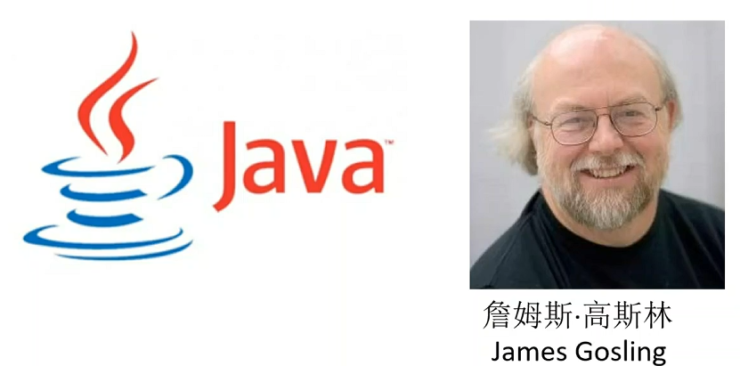 | Java发展史<br /><br />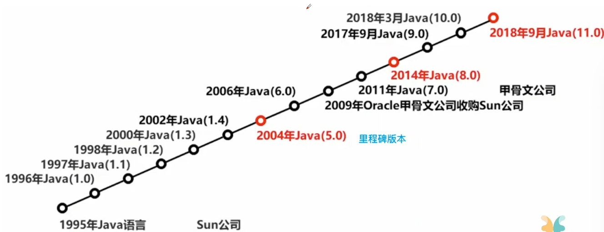 |
|--------------------------------------------------------------------------------------------|-------------------------------------------------------------------------------------|

Java可以用来制作桌面应用程序，面向Internet的应用程序--网站

- Java SE：标准版-->Java技术的基础和核心、主要用于开发桌面应用程序
- Java EE：企业版-->提供企业级应用开发的完整解决方案、用于开发网站

### 2.安装JDK和配置环境变量

不同系统不一样

-->配置后的验证方式：

Windows系统

```dart
Win+R --> 输入cmd --> 回车 --> 打开命令行输入Java --version
```

Linux系统直接输入Java --version就可以了

> 安装和配置网络上都有教程

### 3.Java程序开发步骤

编写-->编译-->运行

源程序【.java】-->编译器【JDK】-->字节码文件【.class】-->Java运行平台【JVM虚拟机】

### 4.Java虚拟机与跨平台原理

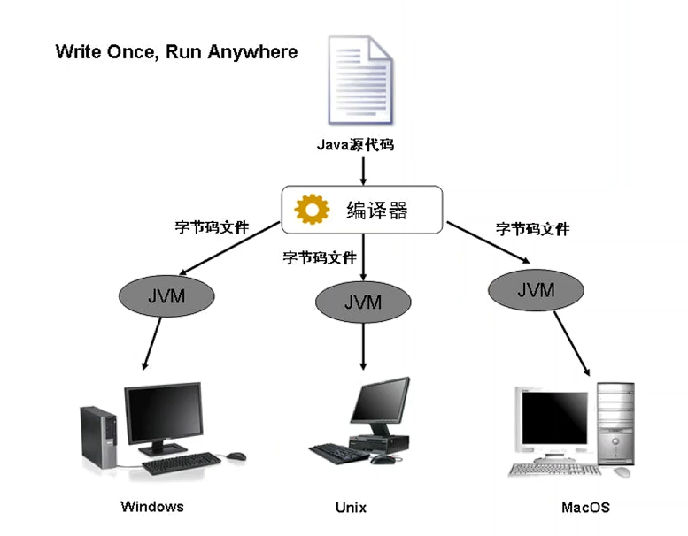

JVM：Java虚拟机。将字节码文件翻译成电脑可以识别的指令。CPU可以读懂的指令。

### 5.编写第一个Java程序

1. 编写程序
2. 使用javac命令编译
3. 使用java命令运行

```java
import java.util.Arrays;

public class Hello {
    public static void main(String[] args) {
        System.out.println("Hello World");
        System.out.println("Hello.main");
        System.out.println("args = " + Arrays.toString(args));
        System.out.println("args = " + args.length);
    }
}
```

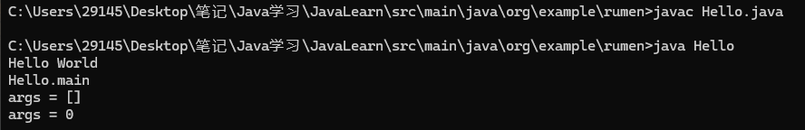

> 注意事项：
>
> 1. 编写源代码
>    1. 后缀名.java
>    2. 文件中代码使用的符号都是英文字符
>    3. 定义的class后面的单词必须要和硬盘上的文件名保持一致
> 2. 编译：javac 文件名-->需要包含后缀名
> 3. 运行：java 文件名-->不需要包含后缀名

### 6.Java程序结构

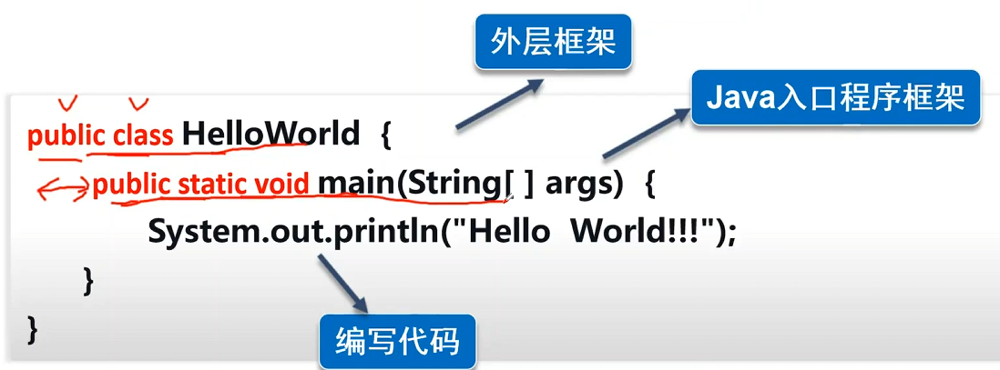

### 7.使用IDE工具--**IDEA**


### 8.字节码文件

- jdk--Java Development Kit:Java开发工具包
- jre--Java Runtime Environment:Java运行时环境

如果我们安装了jdk，默认jre也安装了

jre只提供运行环境

jdk不仅提供了开发编译环境也提供了运行环境


## 变量、数据类型、运算符

### 1.变量概念

**概念**：变量是在程序运行期间其值可以改变的量。

**三要素**：类型，名称和值。

**变量命名规则：**

1. 变量名不能与系统关键字同名
2. 变量名只能包含字母（a^z,A^Z）、数字、下划线、不能用数字开头
3. 标识符必须先定义、后使用
4. 在同一作用域内，标识符不能重复定义
5. 标识符是区分大小写的
6. 标识符要尽量做到“见名知意”，增强程序的可读性

### 2.Java中常用数据类型

整型、浮点型、字符型、字符串类型

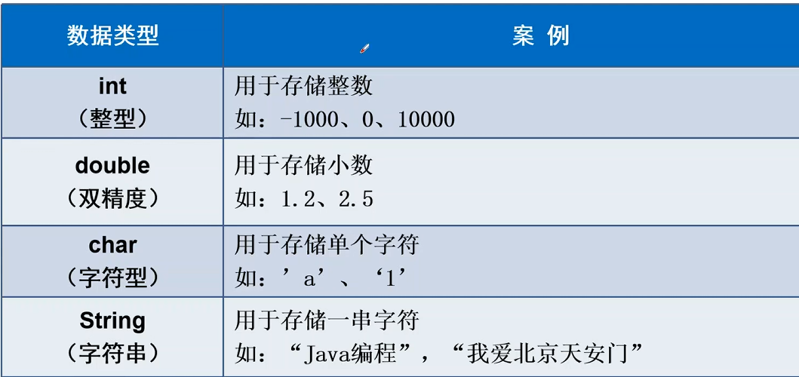

> **补充：**常量-->其值不可以改变的量
>
> ```java
> final double PI=3.14;
> ```
>
> 优点是比较安全、后续代码不允许更改其值
>
> - 常量名通常大写
> - 只能被赋值一次，通常定义时就对其进行初始化
>
> ```JAVA
> public class T2 {
>     public static void main(String[] args) {
>         //常量
>         final double PI=3.14;
> 		//尝试重新赋值
>         PI=4;
>         System.out.println(PI);
>     }
> }
> ```
>
> 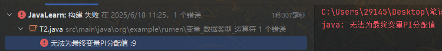

### 3.运算符的分类和使用

赋值、算数运算

**赋值运算符** = 表达式；

**算数运算符**

+、-、*、/、%

**自增、自减运算符**

++、--

```java
public class T3 {
    public static void main(String[] args) {
        //自增运算符
        int num1=1;
        System.out.println(++num1);
        int num2=1;
        System.out.println(num2++);
        /*
         ++在前面，是先参与运算，然后使用值
         ++加变量后面，则是先使用这个值，然后再进行自增
         */
    }
}
```

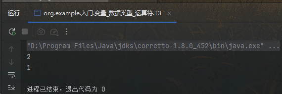

### 4.类型转换

- 自动类型转换
  - 类型相容
  - 目标类型>源类型
- 强制类型转换
  - （类别名）表达式
  - double a=1;
  - int b=(int)a;

```java
public class T4 {
    public static void main(String[] args) {
        //类型转换
        int a=1;
        double b= a;
        int c =(int) b;
        System.out.println(
                "a:"+a+",b:"+b+",c:"+c
        );
    }
}
```

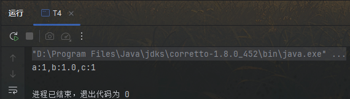

### 5.Scanner类接受用户输入

> ```Java
> Scanner input=new Scanner(System.in);
> //接收整型
> int num=input.nextInt();
> //接受字符串
> String str=intput.next();
> //接收字符
> String char_=input.next.charAt(0);
> ```

```java
import java.util.Scanner;

public class T5 {
    public static void main(String[] args) {
        //Scanner接收输入整型
        Scanner input = new Scanner(System.in);
        int num = input.nextInt();
        System.out.println("输入的数字为"+num);
    }
}
```

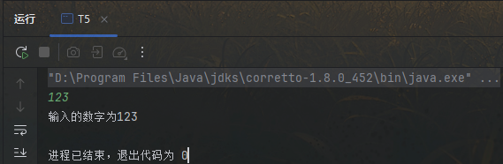

### 6.练习题

> 在Java中保留两位小数
>
> ```Java
> String result_str=String.format("%.2f",result);
> ```

```Java
/**
 * 已知某班有男同学20位，女同学15位，20位男生平均分位87分，15位女生的平均分是85分
 * TODO 问全体同学平均分是多少？
 */
public class T6 {
    public static void main(String[] args) {
        double male=20;
        double female=15;
        double average_male=87;
        double average_female=85;
        double result=(male*average_male+female*average_female)/(male+female);
        String result_str=String.format("%.2f",result);
        System.out.println(result_str);
    }
}
```

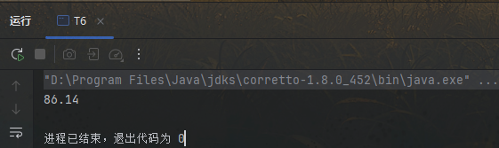


## 选择结构

### 1.关系运算符

### 2.if选择结构

### 3.if-else选择结构

### 4.多重if选择结构

### 5.嵌套if选择结构

### 6.switch选择结构

## 循环结构


## 二重循环


## 一维数组


## 二维数组

